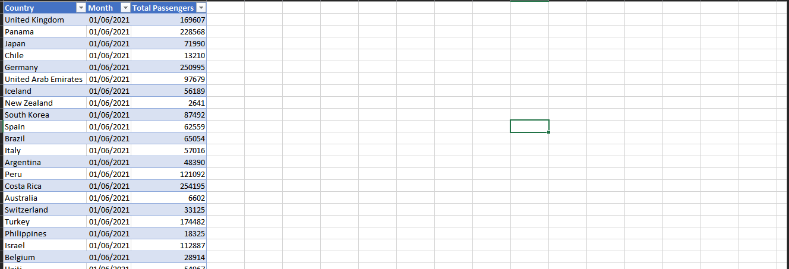
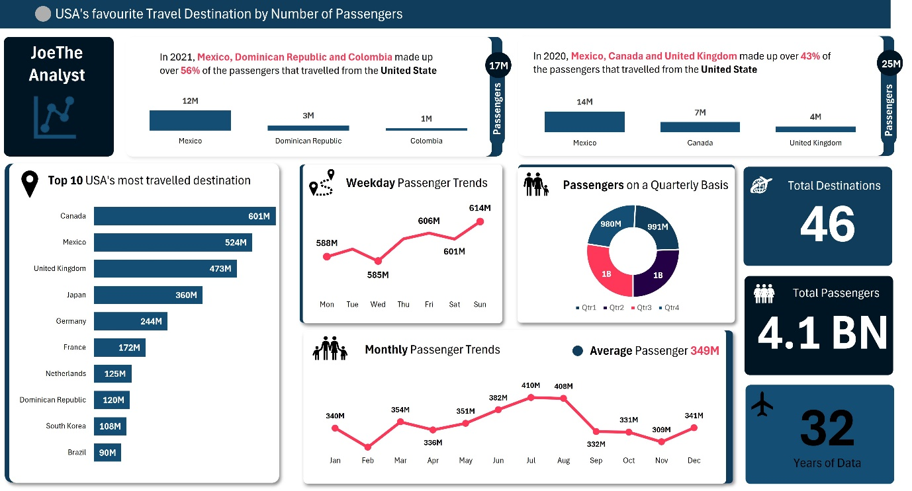

# US International Travel Analysis

**An Analysis of US Outbound Passenger Travel (1990–2021)**
Author: Joseph Dolapo · Tool: Microsoft Excel (PivotTables, PivotCharts, Dashboard Design) · Date: October 2026

A one-page Excel dashboard analysing over three decades of US outbound passenger travel data — identifying the most-travelled destinations, weekday and monthly travel patterns, and how US travel destinations shifted between 2020 and 2021.

---

## Table of Contents

1. [Executive Summary](#1-executive-summary)
2. [Project Overview](#2-project-overview)
3. [Data Overview](#3-data-overview)
4. [Methodology](#4-methodology)
5. [Task 1 — Most-Travelled US Destinations](#5-task-1--most-travelled-us-destinations)
6. [Task 2 — Passenger Trends by Weekday](#6-task-2--passenger-trends-by-weekday)
7. [Task 3 — Passenger Trends by Month](#7-task-3--passenger-trends-by-month)
8. [Task 4 — US Travel Destinations in 2020 vs 2021](#8-task-4--us-travel-destinations-in-2020-vs-2021)
9. [Dashboard Design](#9-dashboard-design)
10. [Key Insights and Findings](#10-key-insights-and-findings)
11. [Repository Structure](#11-repository-structure)
12. [How to Explore This Project](#12-how-to-explore-this-project)
13. [Conclusion](#13-conclusion)

---

## 1. Executive Summary

This project documents the development of the **US International Travel Dashboard**, an Excel-based analysis of US outbound passenger travel spanning **32 years** (1990–2021) across **46 destination countries**, totalling **4.1 billion recorded passengers**. The goal was to turn a flat, transaction-level dataset (Country, Month, Total Passengers) into a single, decision-ready one-page dashboard answering four questions: the most-travelled US destinations, weekday travel trends, monthly (seasonal) travel trends, and how destination preferences shifted between 2020 and 2021.

The dashboard was built entirely with native Excel tools — PivotTables, PivotCharts, and manual dashboard layout — with no external add-ins required.

| Metric                | Value   |
|------------------------|---------|
| Years of Data          | 32      |
| Total Destinations     | 46      |
| Total Passengers       | 4.1 BN  |
| Average Monthly Volume | 349M    |

---

## 2. Project Overview

### 2.1 Background

International travel data is typically published in a flat, transactional format — one row per country, per month — which is accurate for record-keeping but not directly useful for decision-making. This project builds the analytical layer that turns that raw record into clear, actionable answers for a travel analyst, airline planner, or tourism board.

### 2.2 Project Objectives

- Identify the most-travelled US destinations
- Analyse passenger travel trends by day of the week
- Analyse passenger travel trends by month of the year
- Compare US travel destinations across the years 2020 and 2021

All four analyses were required to fit on a **single dashboard page**, so the full picture can be read without scrolling or switching sheets.

### 2.3 Technology and Tools

| Component            | Tool / Technique                                    | Purpose                                                        |
|------------------------|-------------------------------------------------------|---------------------------------------------------------------|
| Data Source            | Flat Excel table (Country, Month, Total Passengers)   | Raw monthly passenger counts by destination country            |
| Data Preparation       | Excel Tables, Filters, Sorting                        | Structuring raw data for reliable PivotTable aggregation       |
| Aggregation Engine     | PivotTables                                           | Summarising passengers by country, weekday, month, and year     |
| Visualisation          | PivotCharts (bar, line, donut)                        | Representing trends and rankings visually on the dashboard      |
| Dashboard Layout       | Cell merging, shape formatting, icons, text boxes     | Assembling a single branded one-page report                    |
| Interactivity          | Slicers / filter buttons                              | Allowing the dashboard to be filtered where needed               |

---

## 3. Data Overview

### 3.1 Dataset Structure

The source dataset is a simple three-column table: **Country**, **Month**, and **Total Passengers**. Each row represents the number of passengers that travelled between the United States and a given country within a given month.


*Figure 1 — Sample of the raw dataset used in the analysis (Country, Month, Total Passengers).*

### 3.2 Data Characteristics

| Field             | Description                                                                 |
|---------------------|---------------------------------------------------------------------------|
| Country             | The destination (or origin) country for the recorded passenger movement    |
| Month               | The calendar month the passenger count was recorded for (date, DD/MM/YYYY) |
| Total Passengers    | The total number of passengers recorded travelling that month for that country |

The dataset spans **32 years** of records across **46 distinct destination countries**, accumulating to **4.1 billion** recorded passengers over the full period.

### 3.3 Data Preparation Steps

- Converted the raw range into a formatted Excel Table so new rows and refreshes are automatically picked up by PivotTables
- Verified the Month column was stored as a true date value (not text) so day-of-week and month-name groupings could be derived correctly
- Checked for and removed duplicate country/month combinations to avoid double-counting in aggregations
- Standardised country name spelling so the same destination was never split across two labels in the PivotTable

---

## 4. Methodology

Each of the four analytical tasks was answered using a dedicated PivotTable and PivotChart pair, all feeding into a single consolidated dashboard sheet:

1. Build a PivotTable from the source table, placing the relevant dimension (country, weekday, or month) in Rows and Total Passengers in Values, summarised by SUM
2. For day-of-week and month analysis, derive a helper column using `WEEKDAY()` and `TEXT(month,"mmm")` so the PivotTable could group correctly by weekday name and month name rather than by raw date
3. Sort the PivotTable results (largest to smallest for rankings; chronological order for trend views)
4. Insert a PivotChart linked to each PivotTable — horizontal bar charts for rankings, line charts for trends over time, and a donut chart for proportional breakdowns
5. Copy/link the finished PivotCharts onto a single dashboard sheet, then format, align, and label them consistently

This PivotTable-driven approach keeps the dashboard fully dynamic — refreshing the source data and clicking **Refresh All** updates every chart with no manual rebuilding required.

---

## 5. Task 1 — Most-Travelled US Destinations

| Rank | Destination          | Total Passengers (All Years) |
|------|------------------------|-------------------------------|
| 1    | Canada                | 601M                          |
| 2    | Mexico                | 524M                          |
| 3    | United Kingdom        | 473M                          |
| 4    | Japan                 | 360M                          |
| 5    | Germany               | 244M                          |
| 6    | France                | 172M                          |
| 7    | Netherlands           | 125M                          |
| 8    | Dominican Republic    | 120M                          |
| 9    | South Korea           | 108M                          |
| 10   | Brazil                | 90M                           |

Canada is the single most-travelled destination for US passengers across the full 32-year history, followed closely by Mexico, with the United Kingdom as the leading overseas destination.

---

## 6. Task 2 — Passenger Trends by Weekday

| Day        | Total Passengers |
|-------------|-------------------|
| Monday      | 588M              |
| Tuesday     | 585M              |
| Wednesday   | 606M              |
| Thursday    | 601M              |
| Sunday      | 614M              |

Passenger volume is relatively stable across the week, dipping slightly on Tuesday (585M) and peaking on Sunday (614M) — a spread of under 5% between the lowest and highest days.

---

## 7. Task 3 — Passenger Trends by Month

| Month      | Total Passengers |
|-------------|-------------------|
| January     | 340M              |
| February    | 354M              |
| March       | 336M              |
| April       | 351M              |
| May         | 382M              |
| July        | 410M              |
| August      | 408M              |
| September   | 332M              |
| October     | 331M              |
| November    | 309M              |
| December    | 341M              |

Travel volume peaks in the Northern Hemisphere summer months of **July (410M)** and **August (408M)**, then falls to a low in **November (309M)** before a modest December recovery. The average monthly volume is **349M**.

---

## 8. Task 4 — US Travel Destinations in 2020 vs 2021

### 2020 (Top 3 — 25M total)

| Rank | Destination     | Passengers | Share |
|------|-------------------|------------|-------|
| 1    | Mexico           | 14M        | 56%   |
| 2    | Canada           | 7M         | 28%   |
| 3    | United Kingdom   | 4M         | 16%   |

### 2021 (Top 3 — 17M total)

| Rank | Destination            | Passengers | Share |
|------|--------------------------|------------|-------|
| 1    | Mexico                  | 12M        | 71%   |
| 2    | Dominican Republic      | 3M         | 18%   |
| 3    | Colombia                | 1M         | 6%    |

Between 2020 and 2021, US travel concentrated even more heavily around Mexico and nearby Latin American/Caribbean destinations, while traditional overseas destinations like the United Kingdom dropped out of the top three entirely. Total top-3 travel volume also fell from 25M to 17M passengers, reflecting continued international travel restrictions.

---

## 9. Dashboard Design


*Figure 2 — The completed one-page US International Travel Dashboard.*

### 9.1 Layout Logic

- **Header band:** dashboard title and branding bar across the top
- **Top row:** side-by-side 2021 vs 2020 "top 3 destinations" comparison cards (Task 4)
- **Left panel:** Top 10 most-travelled destinations as a horizontal bar chart (Task 1)
- **Centre panels:** Weekday Passenger Trends (line chart) and Passengers on a Quarterly Basis (donut chart) (Task 2)
- **Bottom-centre panel:** Monthly Passenger Trends (line chart) with an average reference value (Task 3)
- **Right-hand KPI column:** Total Destinations (46), Total Passengers (4.1BN), and Years of Data (32)

### 9.2 Formatting Choices

- Consistent navy-and-white colour palette, with red used sparingly for key percentage figures
- Icons (location pin, people, plane, calendar) beside each panel title for quick scanning
- Data labels placed directly on bars and line points — no hovering or legend cross-referencing required
- KPI tiles styled as large, bold numbers to draw the eye to the dashboard's headline scale

---

## 10. Key Insights and Findings

- Canada, Mexico, and the United Kingdom are the United States' three most consistently travelled destinations over the full 32-year history
- International travel volume is remarkably stable across the week, with only a ~5% spread between the lowest day (Tuesday) and the highest (Sunday)
- Travel follows a clear seasonal curve, peaking in July/August and bottoming out in November
- The pandemic years sharply concentrated US travel around fewer, more accessible destinations — Mexico's share of the top-3 grew from 56% in 2020 to 71% in 2021
- Total outbound travel volume fell from 25M (2020 top-3) to 17M (2021 top-3), reflecting continued international travel restrictions

---

## 11. Repository Structure

```
US-Travel-Dashboard/
├── README.md                                    ← This file
├── US_International_Travel_Dashboard_Report.docx  ← Full written project report
├── US_International_Travel_Data.xlsx              ← Excel workbook (data, PivotTables, dashboard)
└── images/
    ├── 01-dataset-screenshot.png                 ← Raw dataset sample
    └── 02-dashboard-overview.png                 ← Final dashboard view
```

---

## 12. How to Explore This Project

1. Open **US_International_Travel_Data.xlsx** in Microsoft Excel
2. Review the raw data table, then explore each PivotTable/PivotChart sheet behind the dashboard
3. Click **Data → Refresh All** to see the dashboard recalculate from the source table
4. Read **US_International_Travel_Dashboard_Report.docx** for the full write-up of methodology, findings, and design decisions

---

## 13. Conclusion

The US International Travel Dashboard shows that a single, well-structured Excel workbook — using only PivotTables, PivotCharts, and disciplined dashboard layout — can turn three decades of raw monthly travel records into a one-page report that answers every question asked of it. The dashboard confirms Canada, Mexico, and the United Kingdom as the United States' long-run favourite destinations, reveals a stable weekday travel pattern with a mild weekend peak, surfaces a clear July/August seasonal peak, and captures how dramatically the pandemic years concentrated US travel around a small handful of accessible destinations.

---

*Author: Joseph Dolapo — US International Travel Dashboard Project, October 2026.*
